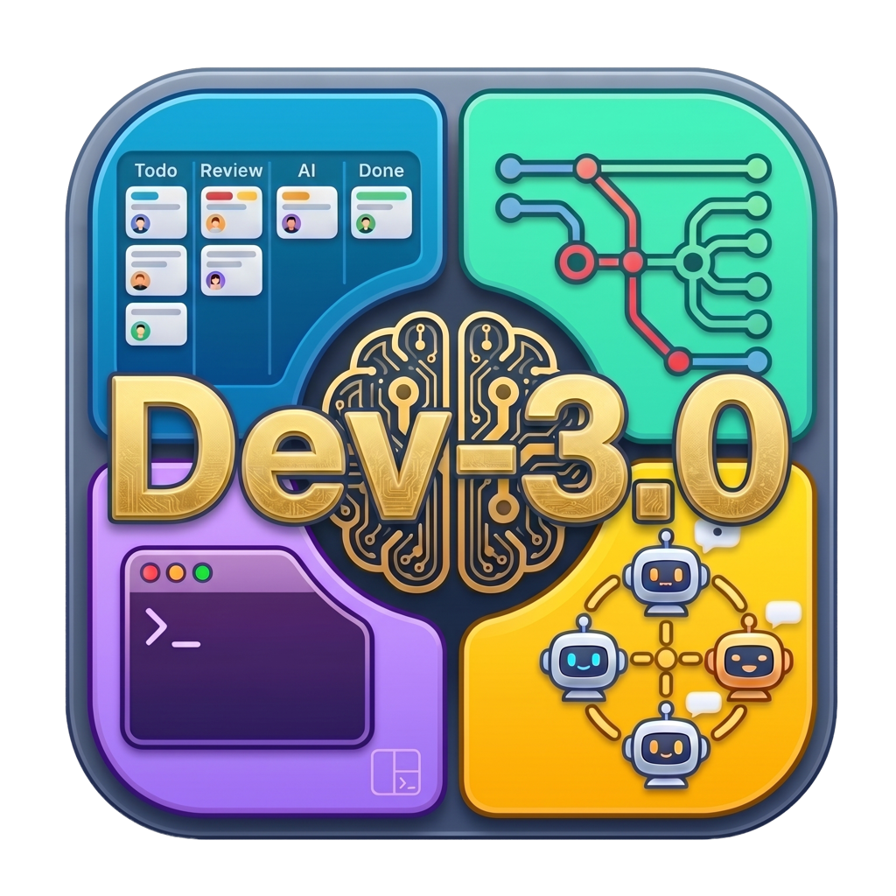
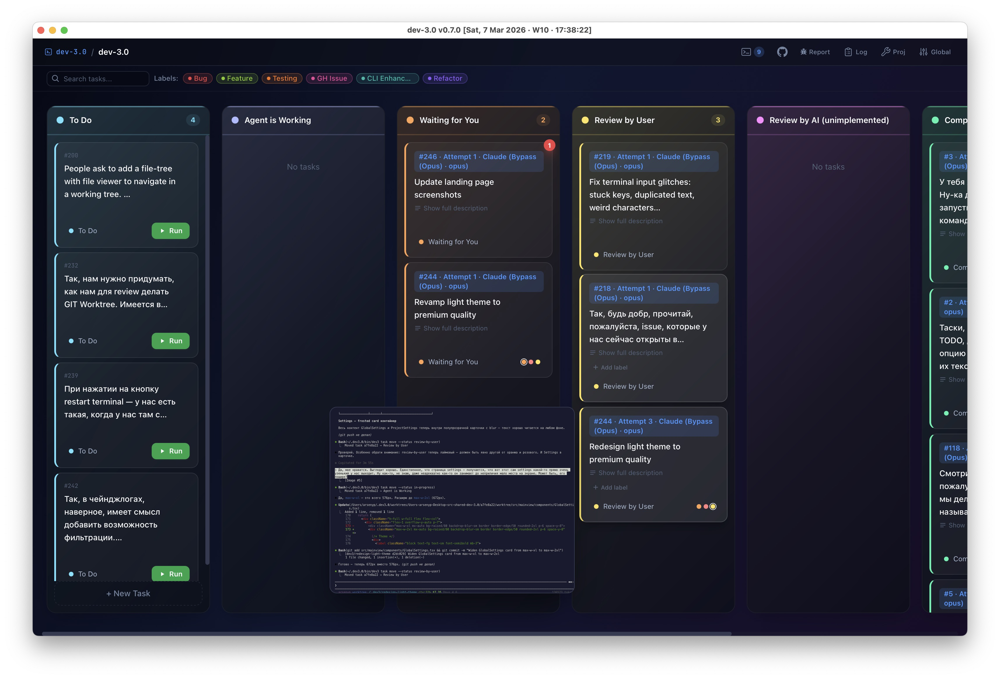
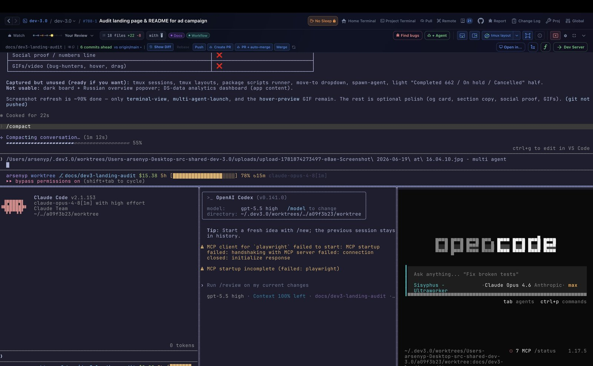
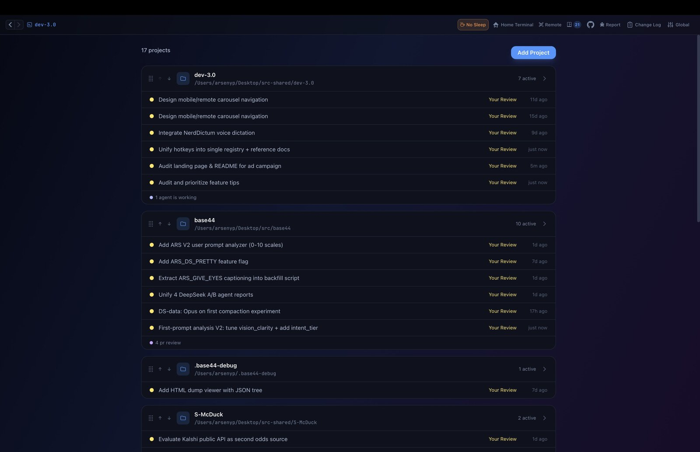
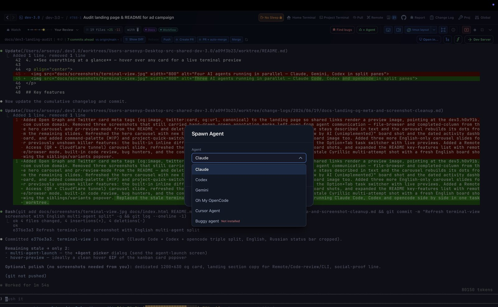
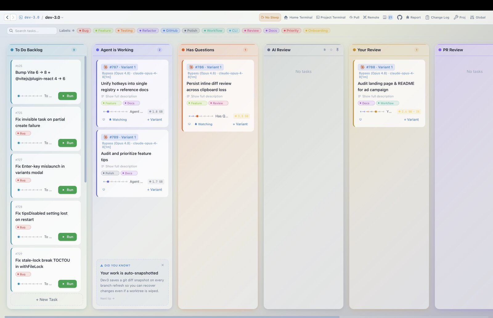
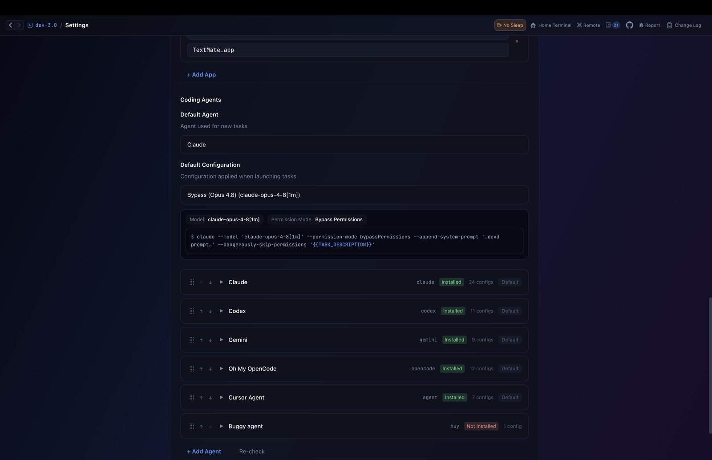
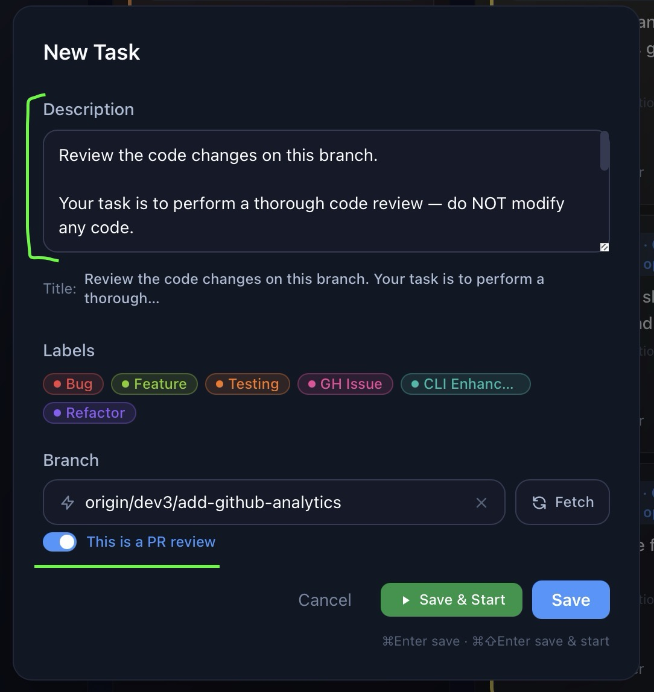
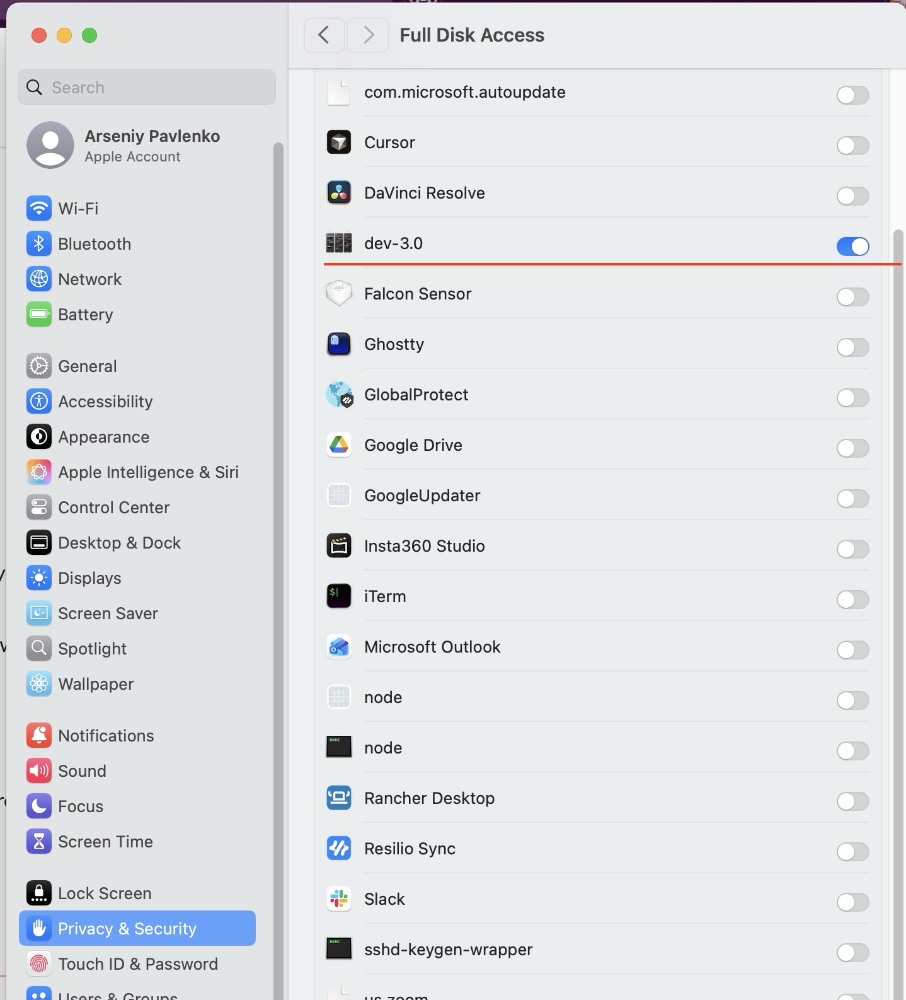

<p align="center">
  
</p>

<h1 align="center">dev-3.0</h1>

<p align="center">
  <strong>Terminal-centric project manager for AI coding agents</strong><br>
  Kanban board meets terminal. Each task gets its own git worktree, tmux session, and full terminal.
</p>

<p align="center">
  <a href="https://github.com/h0x91b/dev-3.0/releases"></a>
  <a href="https://github.com/h0x91b/dev-3.0/stargazers"></a>
  <a href="LICENSE"></a>
  
</p>

<p align="center">
  <a href="https://h0x91b.github.io/dev-3.0/">Website</a> ·
  <a href="https://github.com/h0x91b/dev-3.0/releases">Download</a> ·
  <a href="https://github.com/h0x91b/dev-3.0/issues">Issues</a>
</p>

---

<p align="center">
  
</p>

## The problem

You're running 5+ AI agents across different terminals, repos, and branches. Switching context takes forever. You lose track of what's where. Merge conflicts pile up because multiple agents edit the same repo.

## The solution

dev-3.0 gives you a Kanban board where each task is a fully isolated environment:

1. **Create a task** on the board — describe what needs to be done
2. **An isolated git worktree** is created automatically — zero conflicts between parallel agents
3. **A terminal with tmux** launches inside the worktree with your configured command (e.g., `claude`)
4. **See everything at a glance** — hover over any card for a live terminal preview

<p align="center">
  
</p>

## Key features

- **Kanban workflow** — drag tasks between columns (To Do → In Progress → Review → Completed)
- **Git worktree per task** — full repo isolation, no merge conflicts between parallel tasks
- **Multiple agents per task** — run several agents side by side in the same worktree via tmux split panes
- **Multi-agent launch** — pick any combination of Claude, Cursor, Codex, Gemini, Aider, or any CLI agent — each with its own config
- **Multi-project dashboard** — manage multiple projects from a single Activity view with live agent status
- **Live terminal preview** — hover any card to see what the agent is doing right now
- **Terminal bell alerts** — red badges on cards when an agent needs your attention
- **One-click dev server** — launch, restart, or stop your app from the task's worktree in a single click
- **Custom workflow columns** — define your own pipeline stages (AI Review, PR Review, On Hold, etc.)
- **Labels & search** — organize tasks with colored labels and instant full-text search
- **Dark & light themes** — full theme support for both dark and light environments
- **Automated setup** — configure a setup script per project that runs for every new task
- **Copy-on-Write clone paths** — clone `node_modules`, `.venv`, `build`, and other heavy directories into worktrees instantly with near-zero disk overhead
- **PR review mode** — check out any remote branch and toggle "PR review" to pre-fill a structured code-review prompt for the agent

<p align="center">
  
</p>

<p align="center">
  
</p>

<p align="center">
  
</p>

<p align="center">
  
</p>

<p align="center">
  
</p>

## Install

### Desktop app — macOS

#### Homebrew (recommended)

```sh
brew tap h0x91b/dev3
brew install --cask dev3
```

Auto-installs the required `git`, `tmux`, and `cloudflared` dependencies (the last one powers the public-tunnel option used by `dev3 remote` and the in-app remote-access modal).

```sh
brew upgrade --cask dev3   # update
brew uninstall --cask dev3 # remove
```

#### Manual download

Download the latest `.dmg` from [**Releases**](https://github.com/h0x91b/dev-3.0/releases), drag to Applications, and run. Make sure `git`, `tmux`, and `cloudflared` are installed (`brew install cloudflared` for the public-tunnel feature; safe to skip if you don't need it).

Apple Silicon and Intel are both supported. Windows is on the roadmap.

### Linux

Two install paths, pick whichever fits your setup:

- **Homebrew CLI** — installs the `dev3` command-line tool and the headless web UI server. Works on every Linux box, headless or desktop. This is the path most users want.
- **Desktop GUI bundle** — full Electrobun desktop app for Linux machines with X11/Wayland. Separate tarball download.

#### Homebrew (recommended)

If you don't have Homebrew on Linux yet, install it first (one-time setup). The official installer works on Linux unchanged — same script, same `brew` command. Glibc ≥ 2.28 is required (Ubuntu 18.04+, Debian 10+, RHEL 8+).

> ⚠️ **Don't run the Homebrew installer as `root`.** It refuses by design. On a fresh cloud VM, create a regular user first: `useradd -m -s /bin/bash dev3 && su - dev3`.

```bash
# Prereqs (Debian/Ubuntu — adjust for your distro)
sudo apt-get install -y build-essential procps curl file git

# Install Homebrew (the official installer detects Linux automatically)
/bin/bash -c "$(curl -fsSL https://raw.githubusercontent.com/Homebrew/install/HEAD/install.sh)"

# Add brew to your shell PATH (the installer prints this exact block — copy it)
echo >> ~/.bashrc
echo 'eval "$(/home/linuxbrew/.linuxbrew/bin/brew shellenv)"' >> ~/.bashrc
eval "$(/home/linuxbrew/.linuxbrew/bin/brew shellenv)"
```

Full Homebrew-on-Linux docs: https://docs.brew.sh/Homebrew-on-Linux

Then install dev-3.0 (same tap as macOS, separate command — `tmux` and `git` come along as dependencies):

```sh
brew tap h0x91b/dev3
brew install h0x91b/dev3/dev3
```

This installs the `dev3` CLI. Three ways to use it:

- **Headless / browser UI** — `dev3 remote` prints an ASCII QR, an access URL, and an SSH-forward hint. By default it also starts a Cloudflare quick tunnel so you can connect from anywhere without SSH (`cloudflared` is installed as a brew dep). Pass `--no-tunnel` for local-only mode. The token rotates every 25 seconds; the QR auto-refreshes too. Perfect for remote dev boxes.
- **Desktop GUI** — `dev3 gui` launches the full Electrobun desktop app. On the first run it lazily downloads the bundle (~88 MB) into `~/.dev3.0/gui/` and registers an XDG menu entry. If your distro is missing GTK/WebKit libraries it prints the exact `apt`/`dnf`/`pacman` command for you to copy.
- **CLI tooling** — `dev3 task …`, `dev3 current`, `dev3 note add …` etc. when you want to script the Kanban board from a terminal.

#### Pre-built CLI tarball (no Homebrew)

If you don't want Homebrew at all (e.g. running inside a minimal container), grab the CLI tarball directly:

```sh
# Pick your arch — on Hetzner CPX/CCX it's x64
curl -fsSL -o /tmp/dev3.tar.gz \
  https://github.com/h0x91b/dev-3.0/releases/latest/download/dev3-cli-linux-x64.tar.gz

mkdir -p ~/.dev3 && tar -C ~/.dev3 -xzf /tmp/dev3.tar.gz
~/.dev3/dev3 remote
# (optional) put it on PATH: echo 'export PATH=$HOME/.dev3:$PATH' >> ~/.bashrc
```

Make sure `tmux`, `git`, and `cloudflared` are installed via your package manager (`apt install -y tmux git` on Debian/Ubuntu; for `cloudflared` see [Cloudflare's docs](https://github.com/cloudflare/cloudflared#installing-cloudflared)). Without `cloudflared` `dev3 remote` still works — it just falls back to LAN + SSH-forward URLs (or pass `--no-tunnel` to skip the check).

#### Caveats for cloud VMs

- **IPv4 outbound** is required — GitHub has no AAAA records, and DNS64/NAT64 on IPv6-only cloud VMs is unreliable. On Hetzner Cloud, add a Primary IPv4 (~€0.49/mo) when creating the VM.
- **2 GB VMs** work fine for the brew/tarball install (no build needed). If you ever build from source on one, add 4 GB swap first — vite OOMs on the first build:
  ```bash
  fallocate -l 4G /swapfile && chmod 600 /swapfile && mkswap /swapfile && swapon /swapfile
  echo '/swapfile none swap sw 0 0' >> /etc/fstab
  ```

#### Build from source (contributors)

```bash
apt-get install -y git tmux bash ca-certificates curl unzip
curl -fsSL https://bun.sh/install | bash && source ~/.bashrc

git clone https://github.com/h0x91b/dev-3.0.git && cd dev-3.0
bun install --frozen-lockfile
bun scripts/generate-build-info.ts
bun scripts/generate-changelog.ts
bun --bun ./node_modules/vite/bin/vite.js build   # `bun --bun` avoids Node OOM
bun build src/cli/main.ts              --compile --outfile dist/dev3
bun build src/bun/headless-bootstrap.ts --compile --outfile dist/dev3-server

./dist/dev3 remote
```

## Tech stack

| Component | Technology |
|---|---|
| Desktop runtime | [Electrobun](https://electrobun.dev) — native webview (WKWebView on macOS, WebKitGTK on Linux), no Chromium |
| JS runtime | [Bun](https://bun.sh) |
| Terminal | [ghostty-web](https://github.com/nichochar/ghostty-web) — GPU-accelerated rendering |
| Frontend | React 19, Tailwind CSS, Vite |
| Multiplexer | tmux |

## Development

```bash
bun install
bun run dev          # Build + launch the app locally (no HMR)
bun run build        # Staging build
bun run build:prod   # Production build
bun run lint         # TypeScript type-check
bun run test         # Run tests (fast subset; use `bun run test:full` for CI parity)
```

See [AGENTS.md](AGENTS.md) for full architecture docs and coding guidelines.
See [agent-support-matrix.md](agent-support-matrix.md) for feature compatibility across AI agents.

## Troubleshooting

### macOS — Full Disk Access required for `git` / `tmux`

dev-3.0 runs `git` and `tmux` as child processes. On macOS, the system can silently start blocking file access for these spawned binaries even after they worked fine — usually triggered by an OS update, a TCC database change, or other security-agent activity. It doesn't happen to everyone, and once it kicks in you can't `git` inside dev-3.0 task terminals at all.

Symptoms:

- New task is stuck on **`PREPARING… Fetching origin`** forever — the clone phase hangs and never completes.
- Any `git` command that talks to a remote — `git fetch`, `git pull`, `git push`, `git clone`, `git ls-remote` — hangs indefinitely when run inside a dev-3.0 task terminal. Local-only commands (`git status`, `git log`, `git diff`) keep working.
- The exact same `git fetch` works fine in a regular terminal (iTerm, Terminal.app) — only hangs when spawned from dev-3.0.

**Fix:** Grant **Full Disk Access** to the dev-3.0 app, then restart it.

1. Open **System Settings → Privacy & Security → Full Disk Access**
2. Click **+** and add `dev-3.0` (from `/Applications` or wherever you installed it)
3. Make sure the toggle next to `dev-3.0` is **on**
4. Quit and relaunch dev-3.0

<p align="center">
  
</p>

Why this happens: macOS evaluates permissions per-binary, and TCC (the system permissions database) can silently revoke network/file access for `git`/`tmux` spawned by another app — typically after an OS update or background security-agent activity. Granting Full Disk Access to dev-3.0 covers the app and all its child processes, so `git fetch` to remotes works again.

## Star History

[](https://www.star-history.com/?repos=h0x91b%2Fdev-3.0&type=timeline&logscale=&legend=top-left)

## License

[Apache 2.0](LICENSE) — © 2026 Arseny Pavlenko

