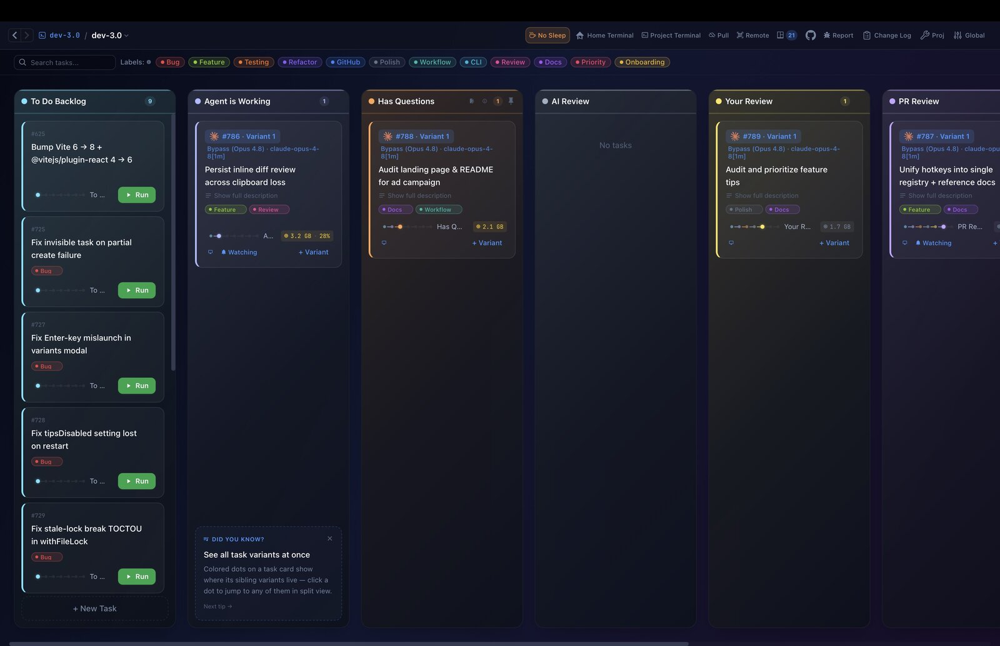
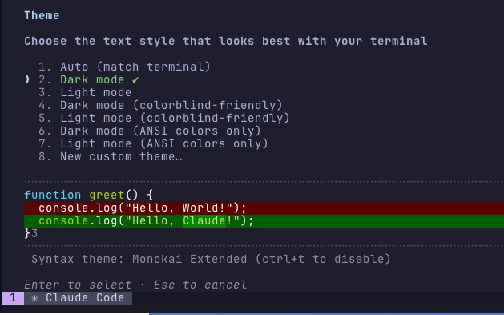

<p align="center">
  
</p>

<h1 align="center">dev-3.0</h1>

<p align="center">
  <strong>Mission control for the One Person Studio</strong><br>
  AI writes the code now — your job is commanding the fleet. dev-3.0 is the Kanban-first cockpit for running dozens of AI coding agents at full speed, while one board keeps you focused. Each task gets its own git worktree, tmux session, and terminal.
</p>

<p align="center">
  <a href="https://github.com/h0x91b/dev-3.0/releases"></a>
  <a href="https://github.com/h0x91b/dev-3.0/stargazers"></a>
  <a href="LICENSE"></a>
  
</p>

<p align="center">
  <a href="https://dev3.h0x91b.com/">Website</a> ·
  <a href="https://github.com/h0x91b/dev-3.0/releases/latest">Download</a> ·
  <a href="https://github.com/h0x91b/dev-3.0/issues">Issues</a>
</p>

---

<p align="center">
  
</p>

## Quick start

🤖 **The fastest way** — paste this into Claude Code, Codex, Gemini CLI, whatever you already run:

```text
Install dev-3.0 by following the guide at https://dev3.h0x91b.com/ai-install.txt
```

The agent reads the guide, detects your OS, and does the whole install itself.

Or by hand — **macOS**:

```sh
brew tap h0x91b/dev3
brew trust h0x91b/dev3   # newer Homebrew refuses untrusted third-party taps (skip on older brew)
brew install --cask dev3
```

**Linux** (headless box, full UI in your browser):

```sh
brew tap h0x91b/dev3 && brew trust h0x91b/dev3 && brew install h0x91b/dev3/dev3
dev3 remote
```

Every option — direct DMG download, CLI tarball without Homebrew, cloud-VM caveats, build from source — in [Install](#install).

## Philosophy

AI writes the code now. It commits, opens PRs, reviews. Your job changed —
from *writing* to *commanding* a fleet of agents across more tasks and projects
than any one head can hold. The bottleneck moved: it's not your editor anymore,
it's your **focus**. Everything in dev-3.0 is built around that. Two things we
optimize for, above all:

**1. Your speed — as one person.**
dev-3.0 optimizes a single developer: *you*. The unit is always the individual,
never the org. It works fine on a team — but it's not a tool for managing other
people; it's a tool for each person to command their own fleet and hit their own
top speed. Everyone focuses on themselves, and the whole moves faster.

**2. Beautiful, and built around you.**
A cockpit you stare at all day should be fast, gorgeous, and keyboard-first — and
it should bend to *your* way of working, not force one on you. Great tooling
doesn't just make you productive; it makes the work fun again. We sweat the polish.

**And what we refuse: dev-3.0 is not an IDE — and won't become one.**

- **The code is the agent's job.** No embedded editor; one click to your real
  VS Code or Cursor when you truly need it — and the goal is to need it less.
- **Git is the agent's job too.** No manual staging, no hand-written commits.
- **Integrate through your agent.** Claude Code, Codex & co. already speak MCP to
  Linear, Jira, and the rest. dev-3.0 is the cockpit; your agent is the adapter.

## The problem

You're running 5+ AI agents across different terminals, repos, and branches. Switching context takes forever. You lose track of what's where. Merge conflicts pile up because multiple agents edit the same repo.

## The solution

dev-3.0 gives you a Kanban board where each task is a fully isolated environment:

1. **Create a task** on the board — describe what needs to be done
2. **An isolated git worktree** is created automatically — zero conflicts between parallel agents
3. **A terminal with tmux** launches inside the worktree with your configured command (e.g., `claude`)
4. **See everything at a glance** — hover over any card for a live terminal preview

<p align="center">
  
</p>

## Key features

- **Kanban workflow** — drag tasks between columns (To Do → In Progress → Review → Completed)
- **Git worktree per task** — full repo isolation, no merge conflicts between parallel tasks
- **Multiple agents per task** — run several agents side by side in the same worktree via tmux split panes
- **Multi-agent launch** — pick any combination of Claude, Cursor, Codex, Gemini, opencode, or any CLI agent — each with its own config
- **Remote / browser mode** — run headless on a server and drive the full UI from any browser (even your phone) with `dev3 remote` — QR login plus an optional Cloudflare tunnel
- **Multi-project dashboard** — manage multiple projects from a single Activity view with live agent status
- **Live terminal preview** — hover any card to see what the agent is doing right now
- **Terminal bell alerts** — red badges on cards when an agent needs your attention
- **One-click dev server** — launch, restart, or stop your app from the task's worktree in a single click
- **Custom workflow columns** — define your own pipeline stages (AI Review, PR Review, On Hold, etc.)
- **Labels & search** — organize tasks with colored labels and instant full-text search
- **Dark & light themes** — full theme support for both dark and light environments
- **Automated setup** — configure a setup script per project that runs for every new task
- **Copy-on-Write clone paths** — clone `node_modules`, `.venv`, `build`, and other heavy directories into worktrees instantly with near-zero disk overhead
- **PR review mode** — check out any remote branch and toggle "PR review" to pre-fill a structured code-review prompt for the agent
- **Built-in code review** — inline diff viewer with syntax highlighting, line-range comments, and one-click export of your review back to the agent
- **Bug hunters** — launch a pack of read-only agents that hunt bugs across your branch diff in parallel
- **Command palette & quick switch** — ⌘⇧P to run any action, ⌘K to jump between projects, Option+Tab to flip between tasks with live previews

<p align="center">
  
</p>

<p align="center">
  
</p>

<p align="center">
  
</p>

<p align="center">
  
</p>

## Which is for you?

Other tools in this space are great — if you want to live in an editor.
dev-3.0 makes a different bet. Pick by your goal, not a feature checklist:

| If you want to… | Reach for… |
|---|---|
| Stay in an editor, hands on the code and git | an **agent IDE** |
| Buy a platform for a whole team (SSO, seats, audit) | a **team orchestrator** |
| Run a fleet of agents **solo**, at speed, without drowning | **dev-3.0** |

## Install

The two fastest paths (agent-driven and Homebrew) are in [Quick start](#quick-start) above. Everything else lives here.

### Desktop app — macOS

#### Homebrew (recommended)

```sh
brew tap h0x91b/dev3
brew trust h0x91b/dev3   # newer Homebrew refuses untrusted third-party taps (skip on older brew)
brew install --cask dev3
```

Auto-installs the required `git`, `tmux`, and `cloudflared` dependencies (the last one powers the public-tunnel option used by `dev3 remote` and the in-app remote-access modal). The tmux dependency is the pinned `h0x91b/dev3/tmux@3.6` — tmux 3.7 has a client-side CPU regression; see [Troubleshooting](#tmux-37--cpu-storms-and-frozen-terminals-pinned-tmux36).

```sh
brew upgrade --cask dev3   # update
brew uninstall --cask dev3 # remove
```

#### Manual download

Grab the latest `.dmg` directly — [**Apple Silicon**](https://github.com/h0x91b/dev-3.0/releases/latest/download/stable-macos-arm64-dev-3.0.dmg) or [**Intel**](https://github.com/h0x91b/dev-3.0/releases/latest/download/stable-macos-x64-dev-3.0.dmg) — drag to Applications, and run. Make sure `git`, `tmux`, and `cloudflared` are installed (`brew install cloudflared` for the public-tunnel feature; safe to skip if you don't need it).

Apple Silicon and Intel are both supported. Windows is on the roadmap.

### Linux — remote work (recommended)

The fastest way to run dev-3.0 on a Linux box (cloud VM, dev server, headless host) is the `dev3` CLI over Homebrew. **Two commands, then `dev3 remote`** — it prints an access URL + QR you open from your laptop. `tmux`, `git`, and `cloudflared` come along as brew dependencies.

> ⚠️ **Don't run the Homebrew installer as `root`** — it refuses by design. On a fresh VM, create a regular user first: `useradd -m -s /bin/bash dev3 && su - dev3`. Glibc ≥ 2.28 required (Ubuntu 18.04+, Debian 10+, RHEL 8+).

**1. Install Homebrew** (one-time). Pick the line matching your shell — the only difference is which rc file gets the PATH:

<details open>
<summary><strong>bash</strong></summary>

```bash
curl -fsSL https://raw.githubusercontent.com/Homebrew/install/HEAD/install.sh | bash && \
  echo 'eval "$(/home/linuxbrew/.linuxbrew/bin/brew shellenv)"' >> ~/.bashrc && \
  eval "$(/home/linuxbrew/.linuxbrew/bin/brew shellenv)"
```

</details>

<details>
<summary><strong>zsh</strong></summary>

```zsh
curl -fsSL https://raw.githubusercontent.com/Homebrew/install/HEAD/install.sh | bash && \
  echo 'eval "$(/home/linuxbrew/.linuxbrew/bin/brew shellenv)"' >> ~/.zshrc && \
  eval "$(/home/linuxbrew/.linuxbrew/bin/brew shellenv)"
```

</details>

**2. Install dev-3.0** (same tap as macOS):

```sh
brew tap h0x91b/dev3 && brew trust h0x91b/dev3 && brew install h0x91b/dev3/dev3
```

**3. Go remote:**

```sh
dev3 remote
```

That's it. Full Homebrew-on-Linux docs: https://docs.brew.sh/Homebrew-on-Linux

This installs the `dev3` CLI. Three ways to use it:

- **Headless / browser UI** — `dev3 remote` prints an ASCII QR, an access URL, and an SSH-forward hint. By default it also starts a Cloudflare quick tunnel so you can connect from anywhere without SSH (`cloudflared` is installed as a brew dep). Pass `--no-tunnel` for local-only mode. The token rotates every 25 seconds; the QR auto-refreshes too. Perfect for remote dev boxes.
  - **Background lifecycle (for SSH boxes)** — `dev3 remote` backgrounds the server by default, so it survives your SSH session (add `--no-detach` to keep it in the foreground). From any later SSH session, `dev3 remote status` shows it (PID, port, uptime), `dev3 remote url` re-prints a fresh QR/URL to re-scan from your phone, `dev3 remote logs --follow` tails its output, `dev3 remote restart` relaunches it, and `dev3 remote stop` shuts it down cleanly.
  - **Run as a service** — `dev3 remote install-service --port <n>` installs a systemd --user unit so the server survives logout and restarts on boot (`dev3 remote uninstall-service` removes it). Tip: `sudo loginctl enable-linger $USER` keeps user services running while you're logged out.
  - **Trusted device** — after you scan the QR once, the browser remembers the session (8h) and reconnects on reload without rescanning.
- **Desktop GUI** — `dev3 gui` launches the full Electrobun desktop app. On the first run it lazily downloads the bundle (~88 MB) into `~/.dev3.0/gui/` and registers an XDG menu entry. If your distro is missing GTK/WebKit libraries it prints the exact `apt`/`dnf`/`pacman` command for you to copy.
- **CLI tooling** — `dev3 task …`, `dev3 current`, `dev3 note add …` etc. when you want to script the Kanban board from a terminal.

#### Pre-built CLI tarball (no Homebrew)

If you don't want Homebrew at all (e.g. running inside a minimal container), grab the CLI tarball directly:

```sh
# Auto-pick your arch: x64 (Intel/AMD, e.g. Hetzner CPX/CCX) or arm64 (Ampere/Graviton, e.g. Hetzner CAX)
case "$(uname -m)" in aarch64|arm64) A=arm64;; *) A=x64;; esac
curl -fsSL -o /tmp/dev3.tar.gz \
  "https://github.com/h0x91b/dev-3.0/releases/latest/download/dev3-cli-linux-$A.tar.gz"

mkdir -p ~/.dev3 && tar -C ~/.dev3 -xzf /tmp/dev3.tar.gz
~/.dev3/dev3 remote
# (optional) put it on PATH: echo 'export PATH=$HOME/.dev3:$PATH' >> ~/.bashrc
```

Make sure `tmux`, `git`, and `cloudflared` are installed via your package manager (`apt install -y tmux git` on Debian/Ubuntu; for `cloudflared` see [Cloudflare's docs](https://github.com/cloudflare/cloudflared#installing-cloudflared)). Without `cloudflared` `dev3 remote` still works — it just falls back to LAN + SSH-forward URLs (or pass `--no-tunnel` to skip the check).

#### Caveats for cloud VMs

- **IPv4 outbound** is required — GitHub has no AAAA records, and DNS64/NAT64 on IPv6-only cloud VMs is unreliable. On Hetzner Cloud, add a Primary IPv4 (~€0.49/mo) when creating the VM.
- **2 GB VMs** work fine for the brew/tarball install (no build needed). If you ever build from source on one, add 4 GB swap first — vite OOMs on the first build:
  ```bash
  fallocate -l 4G /swapfile && chmod 600 /swapfile && mkswap /swapfile && swapon /swapfile
  echo '/swapfile none swap sw 0 0' >> /etc/fstab
  ```

#### Build from source (contributors)

```bash
apt-get install -y git tmux bash ca-certificates curl unzip
curl -fsSL https://bun.sh/install | bash && source ~/.bashrc

git clone https://github.com/h0x91b/dev-3.0.git && cd dev-3.0
bun install --frozen-lockfile
bun scripts/generate-build-info.ts
bun scripts/generate-changelog.ts
bun --bun ./node_modules/vite/bin/vite.js build   # `bun --bun` avoids Node OOM
bun build src/cli/main.ts --compile --outfile dist/dev3

./dist/dev3 remote
```

## Keyboard shortcuts

Press **⌘/** (**Ctrl+/** on Linux) inside the app — or open **Help → Keyboard Shortcuts** — to see
every shortcut in one panel (App + Terminal/tmux tabs). The full list is defined in one place,
`src/mainview/keymap.ts`.

| Action | macOS | Linux |
|---|---|---|
| Go to project (quick switch) | ⌘K | Ctrl+K |
| Command palette | ⇧⌘P | Ctrl+Shift+P |
| Keyboard shortcuts panel | ⌘/ | Ctrl+/ |
| Help mode (explain this screen) | ⇧⌘/ | Ctrl+Shift+/ |
| Back / Forward | ⌘[ / ⌘] | Ctrl+[ / Ctrl+] |
| Switch to project 1–9 (keep view) | ⌘1–9 | Ctrl+1–9 |
| Switch to project 1–9 (flip view) | ⇧⌘1–9 | Ctrl+Shift+1–9 |
| Cycle active tasks (this project / all) | ⌥Tab / ⌥⇧Tab | Ctrl+Tab / Ctrl+Shift+Tab |
| New task | ⌘N | Ctrl+N |
| Add project | ⌘P | Ctrl+P |
| New window | ⇧⌘N | Ctrl+Shift+N |
| Settings | ⌘, | Ctrl+, |
| Zoom in / out / reset | ⌘= / ⌘- / ⌘0 | Ctrl+= / Ctrl+- / Ctrl+0 |
| Hard refresh | ⌘R | Ctrl+R |
| Toggle project terminal / open Quick Shell | ⌘` / ⇧⌘` | Ctrl+` / Ctrl+Shift+` |
| Close dialog / step back | Esc | Esc |
| Quit / Hide | ⌘Q / ⌘H | Ctrl+Q / Ctrl+H |

Terminal multiplexing uses tmux's `⌃B` prefix bindings — see the **Terminal (tmux)** tab in the same panel.

## Tech stack

| Component | Technology |
|---|---|
| Desktop runtime | [Electrobun](https://electrobun.dev) — native webview (WKWebView on macOS, WebKitGTK on Linux), no Chromium |
| JS runtime | [Bun](https://bun.sh) |
| Terminal | [ghostty-web](https://github.com/nichochar/ghostty-web) — GPU-accelerated rendering |
| Frontend | React 19, Tailwind CSS, Vite |
| Multiplexer | tmux |

## Development

```bash
bun install
bun run dev          # Build + launch the app locally (no HMR)
bun run build        # Staging build
bun run build:prod   # Production build
bun run lint         # TypeScript type-check
bun run test         # Run tests (fast subset; use `bun run test:full` for CI parity)
```

See [AGENTS.md](AGENTS.md) for full architecture docs and coding guidelines.
See [agent-support-matrix.md](agent-support-matrix.md) for feature compatibility across AI agents.

## Troubleshooting

### macOS — Full Disk Access required for `git` / `tmux`

dev-3.0 runs `git` and `tmux` as child processes. On macOS, the system can silently start blocking file access for these spawned binaries even after they worked fine — usually triggered by an OS update, a TCC database change, or other security-agent activity. It doesn't happen to everyone, and once it kicks in you can't `git` inside dev-3.0 task terminals at all.

Symptoms:

- New task is stuck on **`PREPARING… Fetching origin`** forever — the clone phase hangs and never completes.
- Any `git` command that talks to a remote — `git fetch`, `git pull`, `git push`, `git clone`, `git ls-remote` — hangs indefinitely when run inside a dev-3.0 task terminal. Local-only commands (`git status`, `git log`, `git diff`) keep working.
- The exact same `git fetch` works fine in a regular terminal (iTerm, Terminal.app) — only hangs when spawned from dev-3.0.

**Fix:** Grant **Full Disk Access** to the dev-3.0 app, then restart it.

1. Open **System Settings → Privacy & Security → Full Disk Access**
2. Click **+** and add `dev-3.0` (from `/Applications` or wherever you installed it)
3. Make sure the toggle next to `dev-3.0` is **on**
4. Quit and relaunch dev-3.0

<p align="center">
  
</p>

Why this happens: macOS evaluates permissions per-binary, and TCC (the system permissions database) can silently revoke network/file access for `git`/`tmux` spawned by another app — typically after an OS update or background security-agent activity. Granting Full Disk Access to dev-3.0 covers the app and all its child processes, so `git fetch` to remotes works again.

### tmux 3.7 — CPU storms and frozen terminals (pinned tmux@3.6)

tmux **3.7** (released June 2026) has a client-side regression: when the tmux server socket is congested, clients busy-spin at 100% CPU instead of waiting, which snowballs into 10–35 second UI freezes. It shows up mainly when **more than one dev-3.0 instance** runs on the same machine (e.g. developing dev-3.0 inside dev-3.0), but any sufficiently busy server can trigger it. tmux **3.6a and older are not affected**.

Because of this, dev-3.0 depends on the pinned keg-only formula **`h0x91b/dev3/tmux@3.6`** and prefers it automatically over whatever `tmux` is in your PATH (a custom binary path set in Settings still wins). Agents inside dev-3.0 terminals pick up the same binary via a shim, so client and server versions never mix.

If you installed dev-3.0 before this pin and already have tmux 3.7 from `brew`:

```sh
brew trust h0x91b/dev3      # newer Homebrew refuses untrusted taps at upgrade time
brew upgrade --cask dev3    # pulls in h0x91b/dev3/tmux@3.6 as a new dependency
```

> **Note:** the in-app updater updates only the app itself — it cannot install the tmux@3.6 keg. Without the keg the app keeps using your PATH tmux (fine for a single dev-3.0 instance); run the two commands above once to get the pinned 3.6a.

The app switches to the 3.6a keg on its own. One caveat: a tmux server keeps its version until it dies, so if a 3.7 dev3 server is still running, the app keeps using 3.7 for that server's lifetime (mixed-version tmux clients can't talk to it at all). After your sessions wind down — or immediately via `tmux -L dev3 kill-server` (kills all dev-3.0 terminals!) or a reboot — everything runs on 3.6a. Your system-wide `tmux` stays untouched.

### Homebrew and updates — recovering from a broken upgrade

dev-3.0 updates through two channels: the **in-app updater** (swaps only the `.app` bundle) and **Homebrew** (`brew upgrade --cask dev3`). After an in-app update, brew's records lag behind the actually-installed version, and an unlucky `brew upgrade` on top of that could remove the app mid-upgrade or replace the bundle under a running instance. The cask is now marked `auto_updates`, so a bulk `brew upgrade` skips dev3 entirely — to update via brew, quit the app and run `brew upgrade --cask dev3` explicitly.

**Start with `dev3 doctor`** — it runs all of these checks automatically (app bundle, tmux shim, pinned tmux keg, Homebrew cask/formula state) and prints the exact fix command for anything broken. It works even when the app can't start. If you'd rather diagnose by hand, find your symptom:

| Symptom | Fix |
|---|---|
| Terminals stop opening with "ENOENT" error toasts right after a `brew upgrade`, while git keeps working | The upgrade replaced the `.app` bundle under the running instance. Quit and relaunch dev-3.0. |
| The app vanished from `/Applications` after a `brew upgrade` that failed ("It seems there is already an App at…", "Directory not empty") | The upgrade died mid-move. Run the full reset below. |
| You installed the DMG manually and want brew to manage updates again | `brew install --cask h0x91b/dev3/dev3 --adopt` — adopts the app in place, nothing is reinstalled. |
| You ran `brew install h0x91b/dev3/dev3` **without `--cask`** and no app appeared | That installs the headless CLI formula, not the desktop app. `brew uninstall --formula dev3`, then `brew install --cask h0x91b/dev3/dev3`. |
| The app won't open after an update (dock icon bounces and gives up), or tmux errors mention "too many levels of symbolic links" | A broken tmux shim. `rm ~/.dev3.0/bin/tmux`, then relaunch — the app recreates it. |

Full reset — safe to run even when brew's state is inconsistent; your projects, tasks, and settings live in `~/.dev3.0` and are not touched:

```sh
brew uninstall --cask dev3 2>/dev/null || true
rm -rf "$(brew --prefix)/Caskroom/dev3"
brew trust h0x91b/dev3 2>/dev/null || true   # newer Homebrew refuses untrusted taps
brew install --cask h0x91b/dev3/dev3
```

### Terminal colors and recommended agent themes

dev-3.0 ships a hand-tuned 16-color ANSI palette for both the **dark** and **light** UI themes, plus a readability filter that remaps unreadable foreground/background colors emitted by agents on the fly.

Every built-in **Claude Code** `/theme` option is supported: Auto, regular Light/Dark, both colorblind-friendly variants, and both ANSI-only variants. Fixed diff colors adapt in both directions when the Claude Code theme and dev-3.0 theme use opposite polarities, so even a Light Claude theme remains readable in dark dev-3.0 and vice versa.

For the most native-looking pairing, use Auto or match the polarity:

| dev-3.0 UI | Claude Code `/theme` | Codex `[tui] theme` |
|---|---|---|
| **Dark** | Dark mode, Dark mode (colorblind-friendly), or Dark mode (ANSI colors only) | **`dracula` (recommended)** |
| **Light** | Light mode, Light mode (colorblind-friendly), or Light mode (ANSI colors only) | **`github` (recommended)** |

If you'd rather have Claude Code render entirely through dev-3.0's tuned 16-color palette, run `/theme` and pick:

- **Dark mode (ANSI colors only)** — when dev-3.0 is on the dark theme
- **Light mode (ANSI colors only)** — when dev-3.0 is on the light theme

<p align="center">
  
</p>

This makes Claude Code emit only the 16 base ANSI colors, which dev-3.0 resolves through its tuned palette.

**Codex** has no "ANSI colors only" mode. Set the recommended matching theme in `~/.codex/config.toml`:

```toml
[tui]
# Recommended when dev-3.0 uses the dark UI
theme = "dracula"
```

```toml
[tui]
# Recommended when dev-3.0 uses the light UI
theme = "github"
```

## Star History

[](https://www.star-history.com/?repos=h0x91b%2Fdev-3.0&type=timeline&logscale=&legend=top-left)

## License

[Apache 2.0](LICENSE) — © 2026 Arseny Pavlenko
