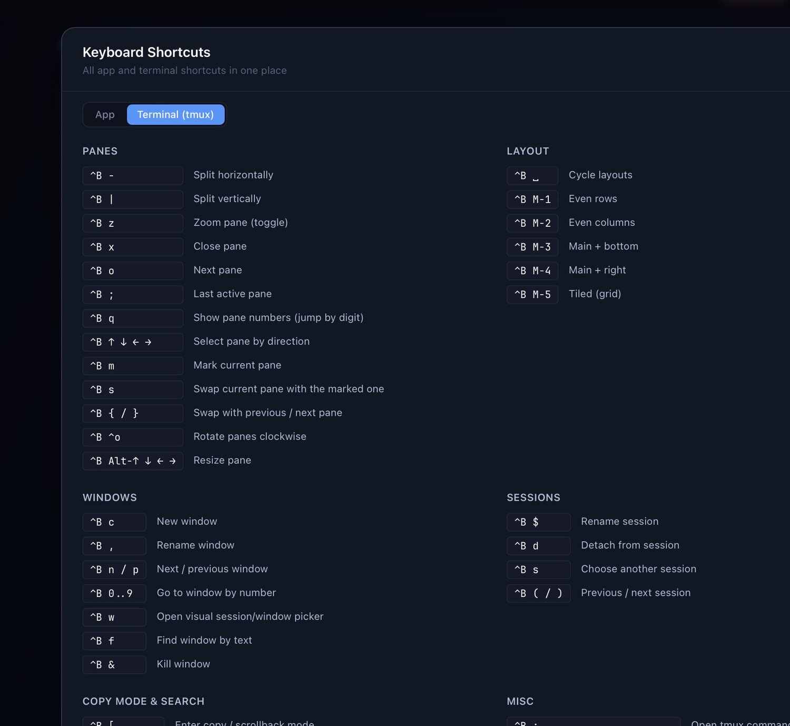

# Keyboard shortcuts

Press **⌘/** (**Ctrl+/** on Linux) inside the app — or open **Help → Keyboard Shortcuts** — to
see every shortcut in one panel (App + Terminal/tmux tabs). This page mirrors that panel.

The single source of truth is [`src/mainview/keymap.ts`](../src/mainview/keymap.ts); the overlay,
this page and the website all read from it.

  

## App

| Action | macOS | Linux |
|---|---|---|
| Go to project (quick switch) | ⌘K | Ctrl+K |
| Command palette | ⇧⌘P | Ctrl+Shift+P |
| Keyboard shortcuts panel | ⌘/ | Ctrl+/ |
| Help mode (explain this screen) | ⇧⌘/ | Ctrl+Shift+/ |
| Open current project/worktree in an app (picker) | ⌘O | Ctrl+O |
| Terminal immersive fullscreen | F11 / ⇧⌘F | F11 / Ctrl+Shift+F |
| Find in the focused terminal / HTML artifact | ⌘F | Ctrl+F |
| Back / Forward | ⌘[ / ⌘] | Ctrl+[ / Ctrl+] |
| Previous / next live variant | ⇧⌘[ / ⇧⌘] | Ctrl+Shift+[ / Ctrl+Shift+] |
| Switch to project 1–9 (keep view) | ⌘1–9 | Ctrl+1–9 |
| Switch to project 1–9 (flip view) | ⇧⌘1–9 | Ctrl+Shift+1–9 |
| Cycle active tasks (this project / all) | ⌥Tab / ⌥⇧Tab | Ctrl+Tab / Ctrl+Shift+Tab |
| New task | ⌘N | Ctrl+N |
| Add project | ⌘P | Ctrl+P |
| New window | ⇧⌘N | Ctrl+Shift+N |
| Settings | ⌘, | Ctrl+, |
| Zoom in / out / reset | ⌘= / ⌘- / ⌘0 | Ctrl+= / Ctrl+- / Ctrl+0 |
| Hard refresh | ⌘R | Ctrl+R |
| Toggle project terminal / open Quick Shell | ⌘` / ⇧⌘` | Ctrl+` / Ctrl+Shift+` |
| Close dialog / step back | Esc | Esc |
| Quit / Hide | ⌘Q / ⌘H | Ctrl+Q / Ctrl+H |

## Terminal

Terminal multiplexing uses tmux's `⌃B` prefix bindings — see the **Terminal (tmux)** tab in the
in-app panel for the current set. They are defined in
[`src/bun/tmux-config.ts`](../src/bun/tmux-config.ts).
