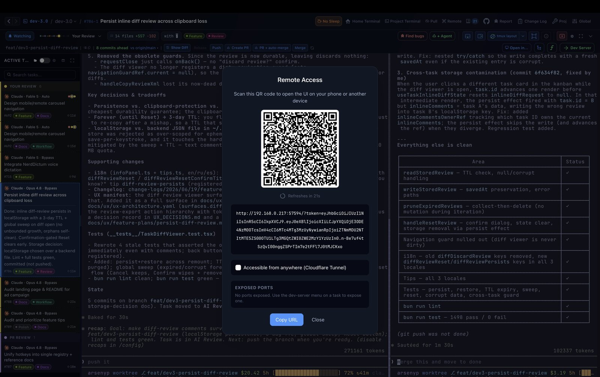

# Remote access

dev-3.0 can run headless and serve its full UI to any browser — a laptop on the same LAN, a
phone anywhere in the world, or your desktop over an SSH tunnel. Same board, same terminals,
same live previews.

```sh
dev3 remote
```

That's the whole thing. It prints an ASCII QR code, a public URL, and an SSH-forward hint.

<p align="center">
  
</p>

## How the connection works

The access URL is signed with a short-lived JWT — **65 seconds, single use** — and the QR
auto-refreshes every 60 seconds. Once you scan it, the browser keeps a trusted session for 8
hours and reconnects on reload without rescanning.

Three ways in, printed on every start:

| | Route | When to use it |
|---|---|---|
| ① | **Cloudflare quick tunnel** (default) | From anywhere, no SSH setup. `cloudflared` ships as a brew dependency |
| ② | **LAN** | Scan the QR from any device on the same network |
| ③ | **SSH port-forward** | Most private — nothing is publicly exposed: `ssh -L <port>:localhost:<port> user@<server>` |

Pass `--no-tunnel` to skip the public tunnel entirely (LAN + SSH only).

## Background lifecycle (for SSH boxes)

`dev3 remote` backgrounds the server by default, so it survives your SSH session. From any
later session:

```sh
dev3 remote status          # running? PID, port, uptime
dev3 remote url             # fresh QR + URL to re-scan from your phone
dev3 remote logs --follow   # tail ~/.dev3.0/remote/remote.log live
dev3 remote restart         # relaunch (accepts start flags, e.g. --port 3000)
dev3 remote stop            # SIGTERM, then SIGKILL fallback
```

Add `--no-detach` to keep it in the foreground instead — required when a supervisor owns the
process (systemd `Type=simple`, a Docker `CMD`, …).

## Keeping the box up to date

A remote box is the one place where "there is an update, press restart" never gets pressed —
nobody opens a terminal on it. So it updates itself.

**By hand, from anywhere:**

```sh
dev3 update --check     # is there anything newer?
dev3 update --dry-run   # which install method was detected, and what would it run
dev3 update             # do it
```

`dev3 update` works out how this dev3 was installed — Homebrew formula, Homebrew cask, or a
plain CLI tarball — and does the right thing for it. On the **canary** channel it always uses
the tarball, because the brew tap only ever carries stable. It refuses, with the reason
printed, when it cannot safely touch the install: running from source, Windows (no CLI
tarball yet), a macOS `.app` Homebrew does not manage, or a cask whose recorded version has
drifted behind the running app. Refusals exit `15`.

**By itself, once the box is quiet.** The server checks every 30 minutes and installs the
update on its own when all three of these have held together for 10 minutes:

- no task in the **In Progress** column,
- no terminal producing output,
- no browser connected.

Past **72 hours** of waiting, only the first condition still applies — otherwise one browser
tab left open on a phone could pin the box on an old build forever. Turn the whole thing off
in **Settings → System → "Update a remote box on its own"** to hold a box on one build while
you investigate something.

**The restart keeps your link.** The dying server hands its port and its *live* `cloudflared`
process to the replacement, so the `*.trycloudflare.com` URL does not change, the host-bound
session cookie still matches, and the browser reconnects on its own. Running agents survive
too — their tmux sessions are detached and task lifecycles are rehydrated at boot.

Two caveats worth knowing:

- **Under systemd** the unit's cgroup is torn down when the unit stops, which takes
  `cloudflared` with it. The update still happens (systemd relaunches the unit), but the
  public URL **changes** — re-run `dev3 remote url`.
- **There is no "updating…" screen.** A silent overnight restart looks exactly like the box
  falling over. `dev3 remote status` prints a `Last update:` line that explains it.

## Run it as a service (Linux)

```sh
dev3 remote install-service --port 3017   # systemd --user unit, enabled on boot
dev3 remote uninstall-service
```

Tip: `sudo loginctl enable-linger $USER` keeps user services running while you are logged out.
Under systemd the log goes to the journal: `journalctl --user -u dev3-remote.service -f`.

## Useful start flags

| Flag | What it does |
|---|---|
| `--port <n>` | Bind a fixed TCP port instead of a random one (ideal for `docker -p 3000:3000` or a preconfigured `ssh -L`) |
| `--no-tunnel` | No Cloudflare tunnel — LAN + SSH forward only |
| `--expose-ports=3000,5173` | Also publish your dev-server ports through their own quick tunnels (one URL per port). Retries for 60 s until each port is actually listening |
| `--no-detach` | Stay in the foreground; Ctrl-C stops it |
| `--views-dir <path>` | Serve static assets from a different directory |

`--static-code=<value>` replaces the rotating token with a fixed one. **Local development
only** — never expose a static code on the public internet.

## Notifications that reach you when nothing is open

The desktop banner needs the app in front of you and the in-browser notification needs a
tab that is open and connected. Neither survives a shut laptop, which is the moment a
blocked agent costs the most. Two destinations do.

### A command or webhook

Create `~/.dev3.0/notifications.json`. Absent or malformed, nothing is sent — dev-3.0
never picks a destination for you.

```json
{
  "transports": [
    { "kind": "exec", "command": ["/Users/you/.dev3.0/notify-hook.sh"] },
    { "kind": "webhook", "url": "https://your-host/notify", "headers": { "authorization": "Bearer …" } }
  ],
  "includeContent": true,
  "levels": ["info", "error"]
}
```

| Key | Default | Meaning |
|---|---|---|
| `transports` | — | `exec` runs a command with the event as JSON on **stdin**; `webhook` POSTs the same JSON |
| `includeContent` | `true` | Include task titles and project names. Also settable per transport |
| `levels` | all | Allowlist of `info` / `success` / `error` |
| `timeoutMs` | `5000` | Per transport |

`chmod 600` it if a transport carries a token. Commands are argv-only and the payload
arrives on stdin, so a task title can never reach a shell. A hook that hangs or fails is
logged and dropped; it cannot fail the task transition that triggered it.

Set `"includeContent": false` on a transport whose operator you would not show a client's
repo name to — a public ntfy topic is readable by anyone who guesses its name. It leaves
the task ids, so the hook can still link back.

### Web Push, including an iPhone

Open dev-3.0 in a browser over HTTPS and enable it under **Settings → Browser
notifications → Push to this device**. The payload is encrypted end to end (RFC 8291), so
Apple's and Google's push services relay it without being able to read it, and dev-3.0
needs no account with either.

Two requirements, and both fail quietly if you miss them:

1. **A valid certificate.** A plain `http://` LAN address is not a secure context and
   cannot register a service worker at all.
2. **On iPhone and iPad, install it first** — Share → Add to Home Screen, then open it
   from that icon. A Safari tab has no notification API whatsoever, so the button will
   tell you so rather than appearing to work.

**Use an origin that does not change.** A quick tunnel gets a new
`*.trycloudflare.com` hostname on every `cloudflared` process, and a subscription is
bound to its origin: after a restart the old registration keeps firing notifications for
an address that no longer loads, and you have to install again. Any of these give you a
stable one:

```sh
# Tailscale — free, private to your tailnet, no domain needed
tailscale serve --bg --https=443 http://127.0.0.1:<port>

# A named Cloudflare tunnel — needs a Cloudflare account and your own domain
cloudflared tunnel create dev3
cloudflared tunnel route dns dev3 dev3.yourdomain.com
cloudflared tunnel run dev3

# or any reverse proxy you already run, terminating TLS in front of dev3 remote
```

Pass `--port` as well, so the port is stable too: the origin is scheme, host **and** port.

> **If that node also has Tailscale Funnel enabled, serve on 443, not another port.** Funnel
> publishes public DNS records for the machine's `ts.net` name, and those point at Tailscale's
> ingress servers, which only terminate TLS for 443. A phone that resolves the name from public
> DNS then fails the handshake on any other port — Safari reports "could not establish a secure
> connection" and the request never reaches your machine at all. Plain HTTP straight to the
> tailnet IP still works, which is a quick way to confirm the tunnel itself is healthy.

## Security notes

- The rotating token is the only credential; treat a live tunnel URL as a live session.
- Diagnostic logs are kept for 14 days locally and redact prompt-bearing payloads and command
  arguments — see [Local diagnostic logs](diagnostic-logs.md).
- SSH port-forwarding exposes nothing publicly and reuses your existing SSH credentials. It is
  the right default for anything sensitive.

`dev3 remote --help` prints the complete flag reference.
