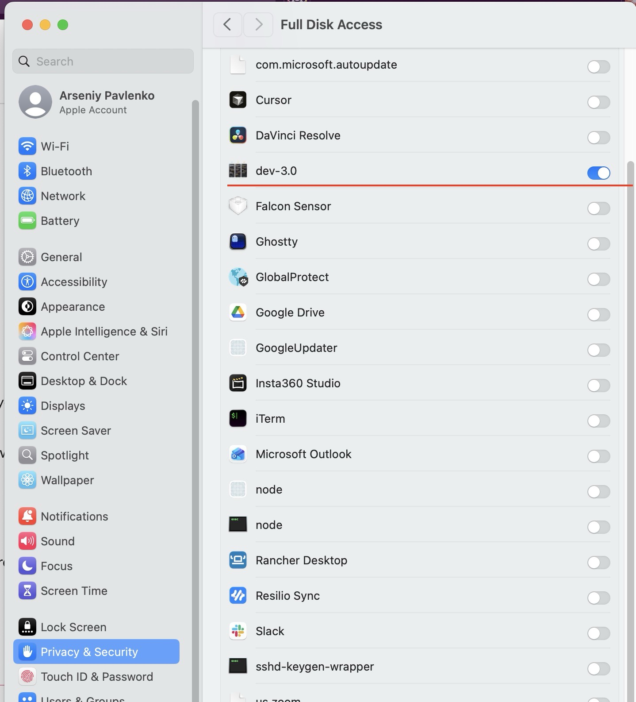
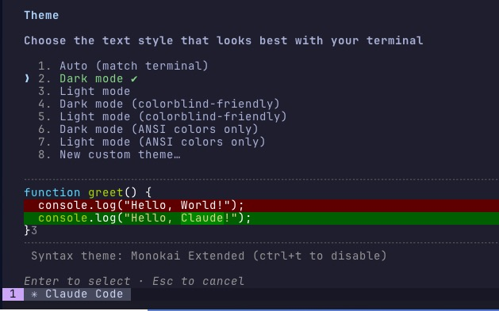

# Troubleshooting

- [Start with `dev3 doctor`](#start-with-dev3-doctor)
- [Which task owns this process?](#which-task-owns-this-process)
- [Where did my disk go?](#where-did-my-disk-go)
- [tmux is missing or terminals do not start](#tmux-is-missing-or-terminals-do-not-start)
- [Git network commands hang only inside dev-3.0 on macOS](#git-network-commands-hang-only-inside-dev-30-on-macos)
- [Terminal colors and recommended agent themes](#terminal-colors-and-recommended-agent-themes)

## Start with `dev3 doctor`

Run this before changing files, reinstalling the app, or creating tmux symlinks:

```sh
dev3 doctor
```

It works while the app is closed and checks the app/CLI versions, the saved tmux path, the
managed shim, the tmux binary (bundled / keg / PATH), and Homebrew state. Follow the commands
printed under the failed check. Do not create `~/.dev3.0/bin/tmux` yourself — dev-3.0 owns and
recreates that shim.

## Which task owns this process?

Native terminal hosts name themselves after their task, so `ps aux` (macOS, Linux) and the
Windows Task Manager **Details → Command line** column show `dev3-terminal-host seq:1383 pane:1`.
Two views can only ever show the executable name — macOS **Activity Monitor**'s Process Name
column and the Windows Task Manager **image-name** column — so for those, ask dev3 directly:

```sh
dev3 doctor --processes        # add --json for scripts
```

It lists every native terminal host and shell with its task number, pane, role, pid and parent
pid, executable, and whether it is still alive. Read-only, works with the app closed, and prints
nothing that is unsafe to paste into a bug report.

## Where did my disk go?

Every task gets its own git worktree under `~/.dev3.0/worktrees/`, and each one carries a full
`node_modules`. Over hundreds of tasks that adds up to tens of gigabytes — and some of it belongs
to task records that no longer exist, so nothing in the app will ever clean it up:

```sh
dev3 doctor --worktrees        # add --json for scripts
```

Per project it shows what is on disk and how much is reclaimable, split into open tasks (keep),
**orphaned** directories with no task record at all, worktrees whose teardown never finished, and
old `diffs/`/`logs/` of tasks finished over a month ago. Report-only — nothing is deleted until
you ask:

```sh
dev3 doctor --worktrees --prune-orphans          # orphans + unfinished teardowns
dev3 doctor --worktrees --prune-older-than 30d   # old diffs/logs of finished tasks
```

A directory whose `dev3/task-*` branch is **not merged** into the base branch is reported and
skipped — that is unpushed work. Add `--force-unmerged` only when you are sure you want it gone.
This is the one dev3 command that deletes anything under `~/.dev3.0/`, and only because you typed
the flag.

## tmux is missing or terminals do not start

macOS releases bundle a self-contained pinned tmux inside the app
(`Contents/Resources/app/tmux/tmux`) and the CLI tarball, so no Homebrew or Command Line Tools
are needed for it. If `dev3 doctor` reports that no usable tmux binary exists, reinstall the app
(or update to the latest version); as an alternative remedy the pinned Homebrew keg still works:

```sh
brew tap h0x91b/dev3
brew trust h0x91b/dev3 2>/dev/null || true
brew install h0x91b/dev3/tmux@3.6
```

On Linux nothing is bundled — install tmux from your package manager and mind the version:
see [tmux on Linux — the version matters](install.md#tmux-on-linux--the-version-matters).

If doctor instead reports `tmux setting` or `tmux shim`, use its reset commands; installing
another tmux will not repair a poisoned saved path.

## Git network commands hang only inside dev-3.0 on macOS

If `git fetch` works in Terminal.app but hangs inside a dev-3.0 task, grant **Full Disk Access**
to dev-3.0 and restart it:

1. Open **System Settings → Privacy & Security → Full Disk Access**
2. Add `dev-3.0` and enable its toggle
3. Quit and relaunch dev-3.0

<p align="center">
  
</p>

## Terminal colors and recommended agent themes

dev-3.0 ships a hand-tuned 16-color ANSI palette for both the **dark** and **light** UI themes,
plus a readability filter that remaps unreadable foreground/background colors emitted by agents
on the fly.

Every built-in **Claude Code** `/theme` option is supported: Auto, regular Light/Dark, both
colorblind-friendly variants, and both ANSI-only variants. Fixed diff colors adapt in both
directions when the Claude Code theme and dev-3.0 theme use opposite polarities, so even a Light
Claude theme remains readable in dark dev-3.0 and vice versa.

For the most native-looking pairing, use Auto or match the polarity:

| dev-3.0 UI | Claude Code `/theme` | Codex `[tui] theme` |
|---|---|---|
| **Dark** | Dark mode, Dark mode (colorblind-friendly), or Dark mode (ANSI colors only) | **`dracula` (recommended)** |
| **Light** | Light mode, Light mode (colorblind-friendly), or Light mode (ANSI colors only) | **`github` (recommended)** |

If you'd rather have Claude Code render entirely through dev-3.0's tuned 16-color palette, run
`/theme` and pick:

- **Dark mode (ANSI colors only)** — when dev-3.0 is on the dark theme
- **Light mode (ANSI colors only)** — when dev-3.0 is on the light theme

<p align="center">
  
</p>

This makes Claude Code emit only the 16 base ANSI colors, which dev-3.0 resolves through its
tuned palette.

**Codex** has no "ANSI colors only" mode. Set the recommended matching theme in
`~/.codex/config.toml`:

```toml
[tui]
# Recommended when dev-3.0 uses the dark UI
theme = "dracula"
```

```toml
[tui]
# Recommended when dev-3.0 uses the light UI
theme = "github"
```

---

Still stuck? Open an issue at https://github.com/h0x91b/dev-3.0/issues — `dev3 doctor --json`
output is safe to paste and helps a lot.
