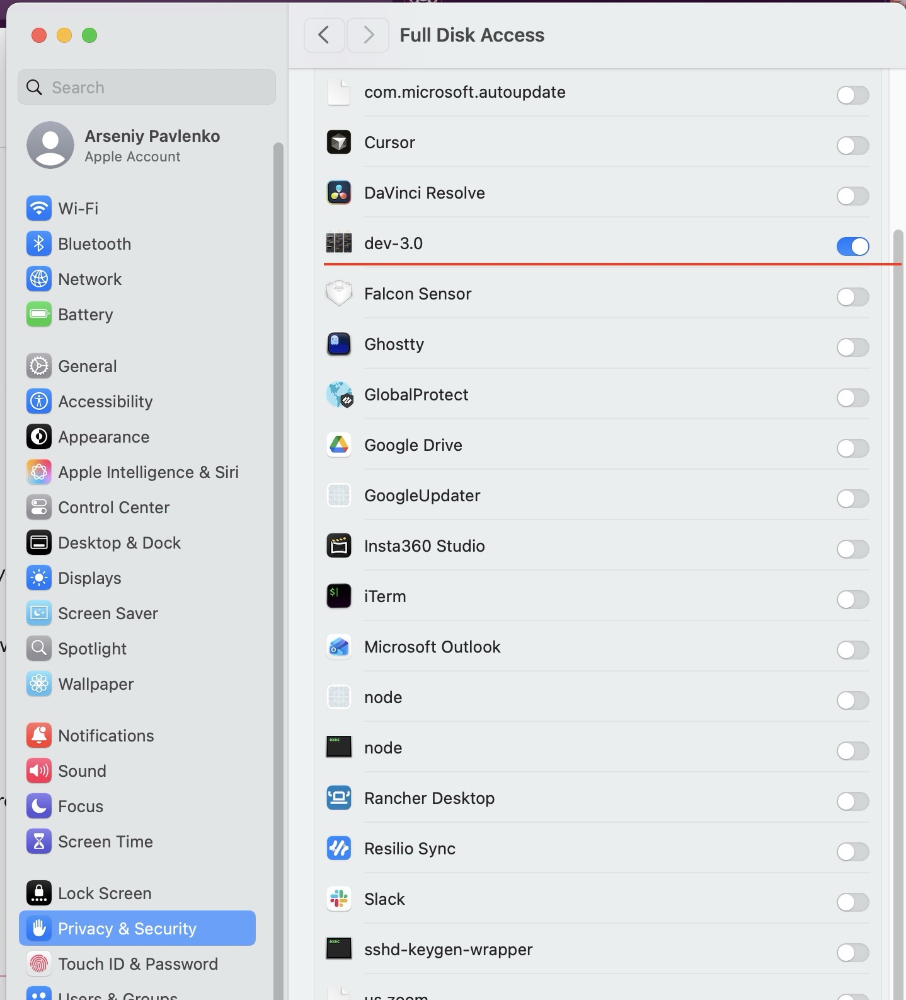
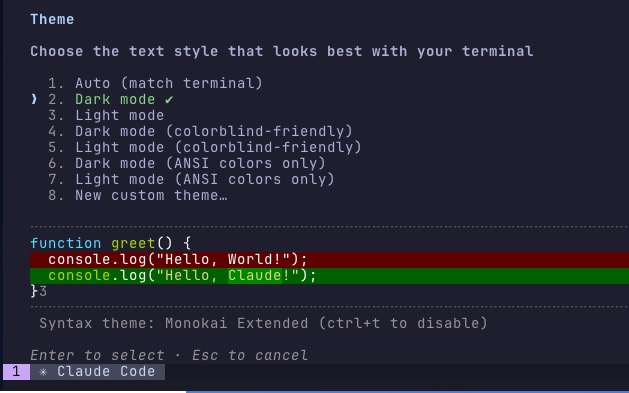

# Troubleshooting

- [Start with `dev3 doctor`](#start-with-dev3-doctor)
- [Which task owns this process?](#which-task-owns-this-process)
- [Where did my disk go?](#where-did-my-disk-go)
- [tmux is missing or terminals do not start](#tmux-is-missing-or-terminals-do-not-start)
- [Git network commands hang only inside dev-3.0 on macOS](#git-network-commands-hang-only-inside-dev-30-on-macos)
- [Task terminals lose access to Desktop or Documents on macOS](#task-terminals-lose-access-to-desktop-or-documents-on-macos)
- [Terminal colors and recommended agent themes](#terminal-colors-and-recommended-agent-themes)

## Start with `dev3 doctor`

Run this before changing files, reinstalling the app, or creating tmux symlinks:

```sh
dev3 doctor
```

It works while the app is closed and checks the app/CLI versions, the saved tmux path, the
managed shim, the tmux binary (bundled / keg / PATH), and Homebrew state. Follow the commands
printed under the failed check. Do not create `~/.dev3.0/bin/tmux` yourself — dev-3.0 owns and
recreates that shim.

## Which task owns this process?

Native terminal hosts name themselves after their task, so `ps aux` (macOS, Linux) and the
Windows Task Manager **Details → Command line** column show `dev3-terminal-host seq:1383 pane:1`.
Two views can only ever show the executable name — macOS **Activity Monitor**'s Process Name
column and the Windows Task Manager **image-name** column — so for those, ask dev3 directly:

```sh
dev3 doctor --processes        # add --json for scripts
```

It lists every native terminal host and shell with its task number, pane, role, pid and parent
pid, executable, and whether it is still alive. Read-only, works with the app closed, and prints
nothing that is unsafe to paste into a bug report.

## Where did my disk go?

Every task gets its own git worktree under `~/.dev3.0/worktrees/`, and each one carries a full
`node_modules`. Over hundreds of tasks that adds up to tens of gigabytes — and some of it belongs
to task records that no longer exist, so nothing in the app will ever clean it up:

```sh
dev3 doctor --worktrees        # add --json for scripts
```

Per project it shows what is on disk and how much is reclaimable, split into open tasks (keep),
**orphaned** directories with no task record at all, worktrees whose teardown never finished, and
old `diffs/`/`logs/` of tasks finished over a month ago. Report-only — nothing is deleted until
you ask:

```sh
dev3 doctor --worktrees --prune-orphans          # orphans + unfinished teardowns
dev3 doctor --worktrees --prune-older-than 30d   # old diffs/logs of finished tasks
```

A directory whose `dev3/task-*` branch is **not merged** into the base branch is reported and
skipped — that is unpushed work. Add `--force-unmerged` only when you are sure you want it gone.
This is the one dev3 command that deletes anything under `~/.dev3.0/`, and only because you typed
the flag.

## tmux is missing or terminals do not start

macOS releases bundle a self-contained pinned tmux inside the app
(`Contents/Resources/app/tmux/tmux`) and the CLI tarball, so no Homebrew or Command Line Tools
are needed for it. If `dev3 doctor` reports that no usable tmux binary exists, reinstall the app
(or update to the latest version); as an alternative remedy the pinned Homebrew keg still works:

```sh
brew tap h0x91b/dev3
brew trust h0x91b/dev3 2>/dev/null || true
brew install h0x91b/dev3/tmux@3.6
```

On Linux nothing is bundled — install tmux from your package manager and mind the version:
see [tmux on Linux — the version matters](install.md#tmux-on-linux--the-version-matters).

If doctor instead reports `tmux setting` or `tmux shim`, use its reset commands; installing
another tmux will not repair a poisoned saved path.

## Git network commands hang only inside dev-3.0 on macOS

If `git fetch` works in Terminal.app but hangs inside a dev-3.0 task, grant **Full Disk Access**
to dev-3.0 and restart it:

1. Open **System Settings → Privacy & Security → Full Disk Access**
2. Add `dev-3.0` and enable its toggle
3. Quit and relaunch dev-3.0

<p align="center">
  
</p>

## Task terminals lose access to Desktop or Documents on macOS

**Symptom:** inside a task terminal, Git reports `not a git repository` for a project under
`~/Desktop` or `~/Documents`, and `ls ~/Desktop` prints `Operation not permitted` — while the same
commands work in Terminal.app. Projects under `~/Desktop` are supported; you do not need to move
them. The task worktree itself lives under `~/.dev3.0/worktrees/`, but Git keeps its data in the
original repository: the worktree's `.git` is a one-line file such as
`gitdir: ~/Desktop/src/app/.git/worktrees/worktree3`. Every Git command in the task therefore reads
the protected folder, and a denial there breaks Git in every task of that project. `Operation not permitted` on these folders is consistent with macOS
privacy protection (TCC), which guards Desktop, Documents, Downloads, iCloud Drive and network
volumes per program
([Apple: Controlling app access to files in macOS](https://support.apple.com/guide/security/controlling-app-access-to-files-secddd1d86a6/web)) —
but an agent sandbox or another security policy returns the same error, so the message alone does
not prove which one is blocking.

**Why the app's own toggle may not be enough:** on macOS, task shells do not run under the
dev-3.0 app process. They run inside a **tmux server** that dev-3.0 starts and that then detaches
and keeps running on its own — it survives quitting the app. The commands you type descend from
that tmux process, not from the running app, and in the observed case the dev-3.0 entry in Full
Disk Access was not enough for them. Apple's Developer Technical Support notes that a child process
which daemonizes itself — as tmux does — can break the link macOS uses to apply an app's
permission to its helpers
([Apple DTS: On File System Permissions](https://developer.apple.com/forums/thread/678819)).

**Observed workaround** (one confirmed case, macOS 26.6): turning Full Disk Access for
`dev-3.0.app` off and on did not help; adding the bundled tmux binary itself to Full Disk Access
restored access. The root cause is not established yet, so treat this as a workaround to try, not
as a requirement for every installation.

### 1. Find the tmux binary that is actually running

First check the task's terminal backend with `dev3 task terminal-backend`. If it says `native`,
the shells run under dev3's native terminal host, not tmux, and this tmux workaround does not
apply — `dev3 doctor --processes` shows that host. No permission fix for the native backend has
been established.

For `tmux`, do not guess the path. From a shell inside the affected task, ask the live server:

```sh
ps -o comm= -p "$(printf '%s' "$TMUX" | cut -d, -f2)"
```

`$TMUX` holds `socket-path,server-pid,session`, so this prints the executable of the server
hosting that pane. If `$TMUX` is empty, `pgrep -lf -- '-L dev3'` lists every dev3 tmux process;
the first path on each line is its binary. If you still cannot tell which binary it is, stop
rather than granting access to an unrelated program. Typical locations:

| Install | tmux binary |
|---|---|
| App in `/Applications` (DMG, in-app updates, Homebrew cask) | `/Applications/dev-3.0.app/Contents/Resources/app/tmux/tmux` |
| App moved elsewhere (e.g. `~/Applications`) | `<that folder>/dev-3.0.app/Contents/Resources/app/tmux/tmux` |
| Homebrew CLI formula (macOS) | `tmux/tmux` inside the formula's `libexec` (a versioned `Cellar` path) |
| Homebrew `tmux@3.6` keg (older installs) | `/opt/homebrew/opt/tmux@3.6/bin/tmux` |
| A custom tmux path set in dev-3.0 | Whatever path you entered |

`dev3 doctor` shows which binary dev-3.0 would pick, but a tmux server started earlier — for
example by a previous app version — keeps running from its original path until it exits, so trust
step 1 for what is running now.

### 2. Add that binary to Full Disk Access

1. Open **System Settings → Privacy & Security → Full Disk Access**. On macOS 13 and later this
   command opens that pane directly (the URL Apple documents in `EndpointSecurity/ESClient.h`):

   ```sh
   open "x-apple.systempreferences:com.apple.settings.PrivacySecurity.extension?Privacy_AllFiles"
   ```

2. Click **+**, then press **⇧⌘G** and paste the full path from step 1 (the file picker does not
   open app bundles by itself). Click **Open**.
3. Make sure the new `tmux` entry is switched on, then retry the command in a task terminal.
   Do not kill or restart the shared tmux server as a repair step: it hosts every running task.

### What you are granting

Full Disk Access is the broadest file permission macOS has: Apple describes it as letting a program
"access all files on your computer, including data from other apps (for example, Mail, Messages,
Safari, and Home), data from Time Machine backups, and certain administrative settings for all
users on this Mac"
([Apple: Change Privacy & Security settings on Mac](https://support.apple.com/guide/mac-help/change-privacy-security-settings-on-mac-mchl211c911f/mac)).
Granting it to tmux extends it to **everything you and your agents run in task terminals**.
**System Settings → Privacy & Security → Files & Folders** holds the narrower per-folder
switches; check whether the app is listed there first
([Apple: Control access to files and folders on Mac](https://support.apple.com/guide/mac-help/control-access-to-files-and-folders-on-mac-mchld5a35146/mac)).
Full Disk Access covers macOS privacy protection only: an agent sandbox or a device-management (MDM) policy can
still deny access, and Full Disk Access does not override them. To revoke it later, select the
`tmux` entry and click **−**.

macOS has no way for an app to grant Full Disk Access itself or to show a consent prompt for it —
Apple lists it as a setting the user must change in System Settings
([Apple: Controlling app access to files in macOS](https://support.apple.com/guide/security/controlling-app-access-to-files-secddd1d86a6/web)).
Keeping new projects outside protected folders avoids the question entirely, but it is optional.

Still open and tracked separately: why the app entry alone was not enough, whether the grant
survives an app update that replaces the bundle, and whether Homebrew installs behave the same way.

## Terminal colors and recommended agent themes

dev-3.0 ships a hand-tuned 16-color ANSI palette for both the **dark** and **light** UI themes,
plus a readability filter that remaps unreadable foreground/background colors emitted by agents
on the fly.

Every built-in **Claude Code** `/theme` option is supported: Auto, regular Light/Dark, both
colorblind-friendly variants, and both ANSI-only variants. Fixed diff colors adapt in both
directions when the Claude Code theme and dev-3.0 theme use opposite polarities, so even a Light
Claude theme remains readable in dark dev-3.0 and vice versa.

For the most native-looking pairing, use Auto or match the polarity:

| dev-3.0 UI | Claude Code `/theme` | Codex `[tui] theme` |
|---|---|---|
| **Dark** | Dark mode, Dark mode (colorblind-friendly), or Dark mode (ANSI colors only) | **`dracula` (recommended)** |
| **Light** | Light mode, Light mode (colorblind-friendly), or Light mode (ANSI colors only) | **`github` (recommended)** |

If you'd rather have Claude Code render entirely through dev-3.0's tuned 16-color palette, run
`/theme` and pick:

- **Dark mode (ANSI colors only)** — when dev-3.0 is on the dark theme
- **Light mode (ANSI colors only)** — when dev-3.0 is on the light theme

<p align="center">
  
</p>

This makes Claude Code emit only the 16 base ANSI colors, which dev-3.0 resolves through its
tuned palette.

**Codex** has no "ANSI colors only" mode. Set the recommended matching theme in
`~/.codex/config.toml`:

```toml
[tui]
# Recommended when dev-3.0 uses the dark UI
theme = "dracula"
```

```toml
[tui]
# Recommended when dev-3.0 uses the light UI
theme = "github"
```

---

Still stuck? Open an issue at https://github.com/h0x91b/dev-3.0/issues — `dev3 doctor --json`
output is safe to paste and helps a lot.
